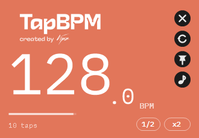

# Tap BPM

A minimal tap tempo tool for Windows. Tap along to a track, read the BPM.



## Install

Download `TapBPM-x.y.z-setup.exe` from [Releases](https://github.com/vipszsz/TAP-BPM/releases)
and run it. It installs per user, so there is no administrator prompt, and it bundles
everything it needs — no .NET runtime to install separately.

## Using it

| Action | How |
| --- | --- |
| Tap | `Space`, `Enter`, or click the lower half of the window |
| Tap while another app is focused | `Ctrl+Alt+Space` (see below) |
| Reset | `R` or the ↺ button |
| Keep above other windows | `T` or the 📌 button |
| Play the tempo back | `M` or the ♪ button |
| Halve / double the tempo | The `1/2` and `x2` buttons |
| Copy the BPM | `Ctrl+C` |
| More options | Right-click anywhere |
| Move the window | Drag the upper half |
| Close | `Esc` |

The reading appears from the second tap and settles as you keep going. The bar under the
number shows how consistent your last few taps have been — when it is full, the reading is
trustworthy to the decimal. Stop for more than 2.5 seconds and the next tap starts fresh.

### Global hotkey

Windows lets only one application own a given shortcut, so `Ctrl+Alt+Space` may already be
taken on your machine. Tap BPM tries a short list and takes the first one that is free; the
active combination is shown at the bottom of the window and in the right-click menu, where
you can also switch the feature off.

## Building from source

Requires the [.NET 9 SDK](https://dotnet.microsoft.com/download/dotnet/9.0).

```bash
dotnet build TapBPM.sln          # compile
dotnet test                      # run the tempo engine tests
dotnet run --project src/TapBpm  # launch it
```

To produce the installer you also need [Inno Setup 6](https://jrsoftware.org/isdl.php):

```bash
dotnet publish src/TapBpm/TapBpm.csproj -c Release -o artifacts/publish
iscc installer/TapBPM.iss
```

The result lands in `artifacts/`. Pushing a `v*` tag builds and publishes it to a GitHub
release automatically.

### Regenerating the icon

`tools/make-icon.ps1` rebuilds `src/TapBpm/Assets/tap-bpm.ico` from a source image, writing
every size Windows actually asks for (16 through 256). A single large frame is what made
the icon come out blank in Explorer and the taskbar in earlier versions.

## Layout of the source

| Path | What lives there |
| --- | --- |
| `src/TapBpm/Core` | Tempo estimation, metronome, global hotkey, settings — no UI |
| `src/TapBpm/Ui` | Custom-drawn controls, palette, embedded font loading |
| `src/TapBpm/MainForm.cs` | The window, laid out in code so it scales at any DPI |
| `tests/TapBpm.Tests` | Tests for the tempo engine, driven by a fake clock |
| `installer/TapBPM.iss` | Inno Setup script |

There are no WinForms designer files: the layout is written in code against logical 96 DPI
units and scaled at runtime, which is what keeps it sharp on high-DPI and mixed-DPI setups.

## Credits

Made by [Vipz](https://open.spotify.com/intl-pt/artist/63F0KeKFXQd5S4b3BKBfAI).

Uses [IBM Plex Mono](https://github.com/IBM/plex) (SIL Open Font License 1.1) and
[NAudio](https://github.com/naudio/NAudio) (MIT).
