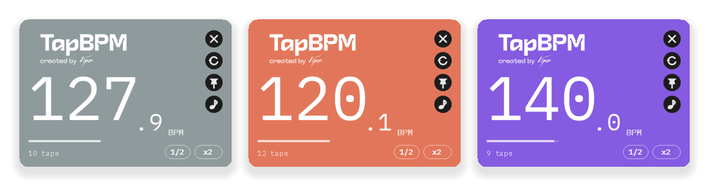

<div align="center">



# Tap BPM

**Bata no ritmo da música. Leia o BPM. O app é isso.**

[](https://github.com/vipszsz/TAP-BPM/actions/workflows/build.yml)
[](https://github.com/vipszsz/TAP-BPM/releases/latest)
[](LICENSE)

[English](README.md)

</div>

---

## Baixar

**[⬇ Baixe o instalador mais recente](https://github.com/vipszsz/TAP-BPM/releases/latest)** — baixe o `TapBPM-x.y.z-setup.exe` e execute.

Não precisa instalar mais nada. Sem .NET, sem dependências, sem senha de administrador.
Windows 10 (versão 1809) ou mais novo, 64 bits.

<details>
<summary><b>O Windows vai mostrar uma tela azul de aviso. Explico o porquê e o que fazer.</b></summary>

<br>

Vai aparecer **"O Windows protegeu o seu computador"**. Clique em **Mais informações** e
depois em **Executar assim mesmo**.

Isso acontece porque o instalador não tem certificado de assinatura de código, que custa
algumas centenas de dólares por ano. O Windows mostra essa tela para todo aplicativo não
assinado, faça ele o que fizer. Se preferir não confiar na palavra de ninguém, dá para
[compilar você mesmo](#compilando-você-mesmo) — o resultado é o mesmo.

</details>

## Como usar

Aperte **Espaço** no ritmo da música. O número aparece a partir da segunda batida e vai
ficando mais preciso conforme você continua.

| O que você quer | Como |
| --- | --- |
| Bater o ritmo | **Espaço** ou **Enter** — ou clique na metade de baixo da janela |
| Bater com a DAW na frente | **Ctrl+Alt+Espaço**, de qualquer lugar |
| Recomeçar | **R** |
| Manter a janela sempre visível | **T**, ou o botão 📌 |
| Ouvir o tempo que você bateu | **M**, ou o botão ♪ |
| Corrigir tempo que saiu na metade ou no dobro | Os botões **1/2** e **x2** |
| Copiar o número | **Ctrl+C** |
| Mover a janela | Arraste a metade de cima |
| Todo o resto | Clique com o botão direito |
| Fechar | **Esc** |

### Lendo o resultado

A **barrinha embaixo do número** mostra o quanto suas últimas batidas foram consistentes.
Quando ela está cheia, pode confiar no valor até a casa decimal. Quando está curta,
continue batendo que ela estabiliza.

Se você parar por mais de 2,5 segundos, a próxima batida começa uma medição nova — dá para
emendar direto na próxima música sem mexer em nada.

Se você errar uma batida, o app ignora. Se você mudar de propósito para outra velocidade,
ele acompanha em duas batidas.

### Sobre o atalho global

**Ctrl+Alt+Espaço** funciona mesmo quando o Tap BPM não é a janela em que você está, então
dá para bater o ritmo com a DAW, o navegador ou o player na frente.

O Windows só deixa um programa usar cada atalho, então se algo na sua máquina já tiver
pegado essa combinação, o Tap BPM pega a próxima livre sem reclamar. O atalho que ele
conseguiu aparece embaixo na janela e no menu do botão direito — onde você também pode
desligar o recurso.

## Dúvidas

**Ele manda alguma coisa para algum lugar?**
Não. Não tem nenhum código de rede. Suas preferências são um arquivinho na sua máquina.

**Onde ficam as configurações?**
Em `%APPDATA%\Vipz\TapBPM\settings.json`. Desinstalar apaga.

**Por que a janela muda de cor toda vez?**
Porque fica mais bonito assim. Botão direito → **New colour** se quiser trocar na hora.

**Meu antivírus acusou.**
Aplicativos .NET self-contained às vezes disparam alarme falso em scanner heurístico. O
código-fonte está todo aqui e o CI compila cada commit publicamente, então dá para ver
exatamente o que entra em cada versão.

**Funciona no Mac ou no Linux?**
Por enquanto não — é um app de Windows.

## Compilando você mesmo

Você precisa do [SDK do .NET 9](https://dotnet.microsoft.com/download/dotnet/9.0).

```bash
git clone https://github.com/vipszsz/TAP-BPM.git
cd TAP-BPM
dotnet run --project src/TapBpm
```

```bash
dotnet test        # os testes do motor de tempo
```

Para gerar o instalador também, você precisa do [Inno Setup 6](https://jrsoftware.org/isdl.php):

```bash
dotnet publish src/TapBpm/TapBpm.csproj -c Release -o artifacts/publish
iscc installer/TapBPM.iss
```

Tudo aparece em `artifacts/`.

<details>
<summary><b>Como o código está organizado</b></summary>

<br>

| Caminho | O que tem lá |
| --- | --- |
| `src/TapBpm/Core` | Cálculo do tempo, metrônomo, atalho global, configurações — sem UI |
| `src/TapBpm/Ui` | Controles desenhados à mão, paleta, carregamento da fonte embutida |
| `src/TapBpm/MainForm.cs` | A janela |
| `tests/TapBpm.Tests` | Testes do motor de tempo, com relógio falso |
| `installer/TapBPM.iss` | Script do Inno Setup |
| `tools/make-icon.ps1` | Regera o `.ico` multi-resolução |

Não há arquivos de designer do WinForms. O layout é escrito em código em unidades lógicas
de 96 DPI e escalado em tempo de execução, que é o que mantém tudo nítido em telas de alta
densidade e em setups com monitores de escalas diferentes.

O tempo é calculado por mínimos quadrados sobre uma janela deslizante das últimas 16
batidas, com descarte de valores discrepantes e medição por `Stopwatch`. É por isso que o
número estabiliza em vez de ficar vagando, e que uma batida errada não estraga a leitura.

</details>

## Créditos

Feito por **[Vipz](https://open.spotify.com/intl-pt/artist/63F0KeKFXQd5S4b3BKBfAI)**.

Construído com [IBM Plex Mono](https://github.com/IBM/plex) (SIL Open Font License 1.1) e
[NAudio](https://github.com/naudio/NAudio) (MIT). Distribuído sob a [licença MIT](LICENSE).
